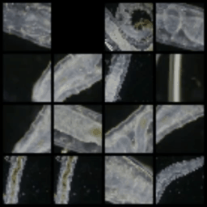

# micro-sim

Simulating microorganisms with machine learning

 

Currently training on [this video](https://youtu.be/ltRaTNdjaiM). The ProcessVideos notebook expects the video to be in `notebooks/datasets/jams-germs/raw-videos` (from youtube-dl), and exports the frames to `../frames/{title}`.

VideoModelUNet takes these frames and trains a recurrent diffusion model to generate videos

 

Visualization of what the model sees during training:

Model output:

 

## Tracking

A goal for this project is to make a real-time simulation with a controllable organism. This requires a video with body movement, orientation, and camera movement tracked. The `datasets` folder contains a Love2D project for manually annotating videos in this way and a tracking file for [this video](https://youtu.be/H3jCiKa6BS8), though something like [DeepLabCut](https://github.com/DeepLabCut/DeepLabCut) will likely be used in the future.

